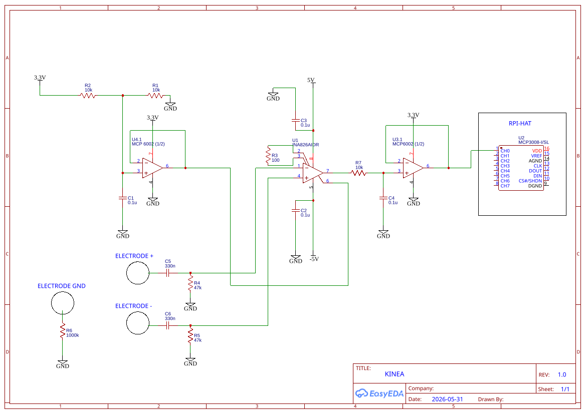
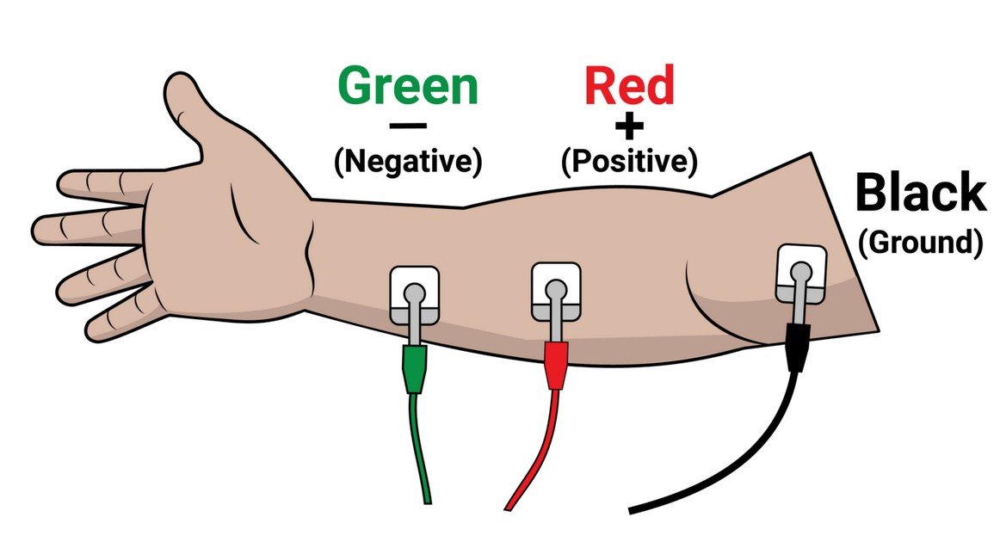
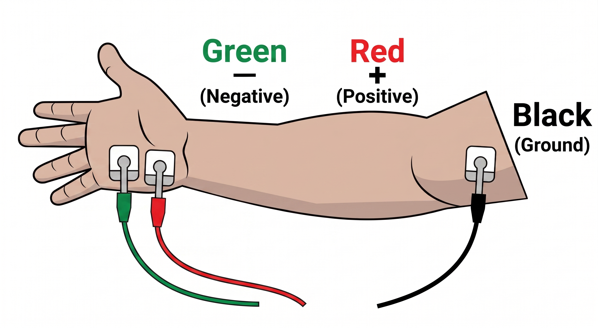
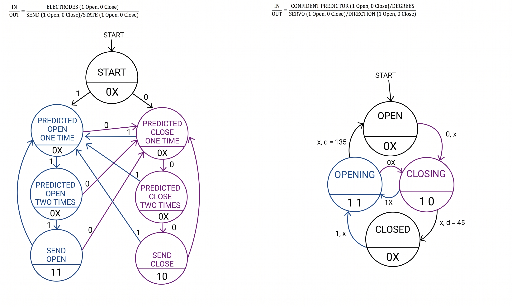

# KINEA: EMG-Controlled Bionic Hand Project

A robotic hand that you control with your own muscles. We read the electrical activity from the forearm with surface electrodes, clean up that signal in hardware, and use it to decide whether the hand should open or close.

Built with Python, Flask, scikit-learn and NumPy on a Raspberry Pi, with a custom INA826 + MCP3008 analog front-end.

The goal was simple: build a working proof of concept for a low-cost myoelectric prosthetic. Commercial bionic hands work well but cost thousands. We wanted to see how far we could get with hobbyist parts, a microcontroller, and a careful analog front-end. The hard part is never the motors. It is reading a clean muscle signal off the skin without drowning it in noise.


## EMG Signals Study

Electromyography (EMG) is the measurement of the electrical signals your muscles produce when they contract. When your brain tells a muscle to fire, motor neurons send action potentials down to the muscle fibers. Those firings add up into a small voltage that spreads through the tissue and reaches the surface of your skin. By placing electrodes on the skin over a muscle, we can pick up a tiny version of that voltage. This is called surface EMG (sEMG).

The signal is small and messy. The useful frequency content sits roughly between 20 Hz and 500 Hz, with most of the energy around 50–150 Hz. The amplitude at the skin is usually in the range of tens of microvolts up to a few millivolts. That is the core problem: the signal we care about is tiny, and it shares the same space as a lot of unwanted electrical noise. The biggest offender is mains hum at 50/60 Hz, which sits right in the middle of our useful band, plus general interference picked up by the body acting like an antenna.

The trick to reading it is differential measurement. We place two electrodes a short, fixed distance apart along the same muscle. The muscle activity reaches each electrode at a slightly different time and strength, so the two readings differ. The noise, on the other hand, hits both electrodes almost identically. If we subtract one electrode from the other, the shared noise cancels out and the muscle activity survives. That subtraction is the foundation of the whole circuit.

## Hardware Development and Circuit Justification

The board is built as a Raspberry Pi HAT. The analog front-end conditions the muscle signal and hands a clean, safe voltage to the on-board ADC, which the Raspberry Pi then reads over SPI. The values below are taken directly from the schematic.

| Ref | Value | Role in the circuit |
|-----|-------|---------------------|
| U1 | INA826 | Instrumentation amplifier (input stage) |
| U2 | MCP3008 | 10-bit SPI ADC |
| U3 | MCP6002 | Output buffer to the ADC (3.3 V single supply) |
| U4 | MCP6002 | Reference buffer (1.65 V follower) |
| R3 | 100 Ω | INA gain resistor (R_G) |
| R1, R2 | 10 kΩ | Reference voltage divider (1.65 V) |
| R4, R5 | 47 kΩ | Input high-pass shunt (with C5/C6) |
| C5, C6 | 330 nF | Input AC-coupling / high-pass (with R4/R5) |
| R7 | 10 kΩ | Output low-pass series resistor (with C4) |
| C4 | 0.1 µF | Output low-pass shunt (with R7) |
| C1 | 0.1 µF | 1.65 V reference filter |
| C2, C3 | 0.1 µF | INA ±5 V supply decoupling |
| R6 | 1 MΩ | Reference-electrode series resistor to GND |


**Noise cancellation with the INA826.** The `ELECTRODE +` and `ELECTRODE -` pads feed the two inputs of the instrumentation amplifier (U1). An INA is built for exactly this job: it amplifies the *difference* between its inputs while rejecting anything common to both. The noise is common to both electrodes, so it gets cancelled (high common-mode rejection); only the real muscle signal is amplified. The gain is set by the single resistor R3 on the RG pins. For the INA826:

$$
\begin{aligned}
G &= 1 + \frac{49.4\text{ k}\Omega}{R_G} \\
&= 1 + \frac{49\,400}{100} \\
&= 495\text{ V/V} \quad (\approx 53.9\text{ dB})
\end{aligned}
$$


A gain of ~495 is a good fit for EMG, where the raw signal is well under a few millivolts.

**Ground reference electrode.** The third pad, `ELECTRODE GND`, is placed on a neutral spot, usually a bony area with little muscle activity, and tied to the circuit ground through R6 (1 MΩ). The body floats at its own electrical potential, and if that does not match the circuit's ground, the readings drift. This electrode pins the body's potential to our reference, and the 1 MΩ series resistor keeps any current through the electrode safely small.

**Filtering (band-pass).** The front-end is a band-pass built from two stages plus supply decoupling. At the input, each electrode is AC-coupled with a 330 nF series capacitor (C5/C6) and a 47 kΩ shunt resistor to ground (R4/R5), which sets the high-pass corner:

$$f_{\text{high-pass}} = \frac{1}{2\pi \cdot 47\,000 \cdot 330 \times 10^{-9}} \approx 10.3\text{ Hz}$$

This strips the electrode's DC offset and the slow baseline drift from motion and contact shifts. After the INA, R7 (10 kΩ) and C4 (0.1 µF) form the low-pass corner before the output buffer:

$$f_{\text{low-pass}} = \frac{1}{2\pi \cdot 10\,000 \cdot 0.1 \times 10^{-6}} \approx 159\text{ Hz}$$

The two corners give a pass-band of roughly 10–159 Hz, which sits right on the dominant EMG energy (50–150 Hz). On top of that, C2 and C3 (0.1 µF) decouple the INA's ±5 V supply pins, and C1 (0.1 µF) filters the 1.65 V reference.

**Buffer and 1.65 V voltage offset.** This was the part that took the most thought. The INA subtraction naturally produces a signal that swings both positive *and* negative around 0 V. The ADC cannot accept negative voltages, and feeding it one risks damaging the chip. So we build a reference with the R1/R2 divider from the 3.3 V rail:

$$V_{\text{ref}} = 3.3\text{ V} \cdot \frac{R_2}{R_1 + R_2} = 3.3 \cdot \frac{10\text{ k}\Omega}{10\text{ k}\Omega + 10\text{ k}\Omega} = 1.65\text{ V}$$

An MCP6002 op-amp (U4) buffers this 1.65 V so it can drive the INA's REF pin without being loaded down. The INA output then floats around 1.65 V instead of 0 V, keeping the bipolar EMG signal positive at all times. A second MCP6002 (U3) buffers the filtered signal into the ADC. Because U3 runs on a single 3.3 V supply, its output cannot swing past 0 V or 3.3 V, which gives the MCP3008 an extra layer of protection. With a gain of 495, the output stays inside the 0–3.3 V window as long as the differential input stays within:

$$\pm \frac{V_{\text{ref}}}{G} = \frac{\pm 1.65\text{ V}}{495} \approx \pm 3.3\text{ mV}$$

That window comfortably covers real surface-EMG amplitudes, and it keeps the signal safely inside the **MCP3008**'s input range, which must stay between 0 V and VDD = 3.3 V. The ADC is 10-bit, so each code is worth 3.3 V / 1024 ≈ 3.22 mV.

**Power supply.** The INA826 needs a symmetric supply, so it runs on +5 V and −5 V rails. Everything else — both MCP6002 op-amps, the reference divider and the MCP3008 — runs on a single 3.3 V rail. (The MCP6002 tops out near 6 V, so it could not sit on the ±5 V rails anyway).



The electrodes can be placed in different valid positions.





## Software Architecture & Processing

The software runs on the Raspberry Pi. The real-time part is built around classes — `Reader`, `Predictor` and `Hand` — so each job is isolated and easy to test. The offline scripts (`collect_emg` and `train_model`) are plain procedural scripts, since they run start to finish once and don't need the same structure.

The whole system is a short pipeline, from raw voltage to a moving servo:

```
ADC sample → 250 ms window → 5 features → scale → classify → stability filter → servo
```

### Data pipeline

There are three stages, run in order:

1. **`collect_emg.py`** — records your muscle signal and stores it as labelled training data.
2. **`train_model.py`** — trains a classifier on that data and saves the result.
3. **`app.py`** — runs the live system: it reads the muscle in real time, predicts the gesture, and moves the hand.

### Why Machine Learning instead of a simple threshold?

Most basic EMG projects just use a voltage threshold: if the signal spikes over a certain value, close the hand. We looked at the raw output on an oscilloscope and quickly realized that approach is too fragile for the real world.

A slight shift in the electrodes, a bit of sweat, or normal muscle fatigue drastically changes the absolute amplitude of the signal. A hardcoded threshold breaks the moment your setup shifts by a millimeter.

But the oscilloscope showed us something else: even when the raw voltage drops or spikes, the underlying shape and energy distribution of the muscle burst stay distinct. That is why we went with Machine Learning instead of simple if/else statements.

By feeding a classifier time-domain features (like zero crossings and waveform length), the model learns to recognize the actual pattern of a muscle contraction rather than just looking at a peak voltage. This makes the hand significantly more robust against minor hardware quirks, slight electrode disconnections, and the inevitable baseline drift that happens between sessions.

### Feature extraction (the five metrics)

We don't feed raw samples to the model. Each reading is grouped into short windows of 50 samples (about 250 ms at 200 Hz), and for every window we compute five time-domain features. These are cheap to calculate and describe the shape and energy of a muscle burst well:

- **RMS** (root mean square) — the overall energy of the signal in the window.
- **MAV** (mean absolute value) — the average signal level, another energy measure.
- **ZC** (zero crossings) — how often the signal crosses its own mean, a rough indicator of frequency.
- **WL** (waveform length) — the total length of the waveform, capturing how much and how fast it moves.
- **VAR** (variance) — how much the signal spreads around its mean.

`collect_emg.py` writes these five features per window, labelled with the gesture, into a CSV. `train_model.py` reads the exact same five columns. That way the features the model learns from are identical to the ones it sees live, which keeps training and inference consistent.

### Model training and accuracy

`train_model.py` compares four classifiers on the recorded data: SVM (RBF kernel), k-Nearest Neighbours, Random Forest and Logistic Regression. It scores each one with 5-fold cross-validation, scales the features with `StandardScaler`, then keeps the best model and saves it next to its scaler (`emg_model.pkl` and `emg_scaler.pkl`).

A note on accuracy. On the data it was just trained on, the models reach close to 100%. That figure is naturally optimistic. EMG depends heavily on electrode placement, skin condition, and muscle fatigue, and all of these drift between sessions. Because we use an ML approach rather than rigid thresholds, the system is actually quite resilient to this drift and usually performs well even if you take the hardware off and put it back on later. However, accuracy still drops slightly once the physical setup changes or some time passes. To guarantee near-100% precision, the model should be trained per user, and ideally retrained per session, instead of being shipped as a fixed file.

### Real-time control

At runtime, `app.py` loops continuously: `Reader` takes a window and extracts the features, `Predictor` scales them and runs the model, and `Hand` drives the servo.

Controlling the hand is a state machine. The problem with EMG is that a single noisy window can flip the prediction for a moment. To stop the hand from twitching, `Predictor` keeps a short history and only commits to a new state once the last *N* windows all agree (a stability filter). The servo only moves when that stable decision actually changes the state, so a run of repeated "open" predictions doesn't keep re-sending the same command.



### Visualization

We built two ways to see what the signal is doing:

- A **Flask web dashboard** that shows the live RMS level, the current prediction and the hand state, refreshed a few times a second.
- A **live terminal monitor** inside `collect_emg.py`. Before recording, it prints a moving RMS/MAV bar so we can confirm the electrodes are making good contact and that the signal actually reacts when we flex. This was essential for catching bad electrode placement before wasting a recording session.

### What each file does

| File / folder | Role |
|---------------|------|
| `app.py` | The live system: the real-time control loop plus the Flask dashboard. |
| `reader.py` | Samples the ADC over SPI and turns each window into the five features. |
| `predictor.py` | Scales the features, runs the trained model, and applies the stability filter. |
| `hand.py` | Drives the servo and tracks whether the hand is open or closed. |
| `collect_emg.py` | Records labelled feature windows to a CSV; includes the live signal monitor. |
| `train_model.py` | Trains and compares the classifiers, then saves the best model and its scaler. |
| `templates/`, `static/` | The Flask dashboard front-end (HTML, CSS, JS). |
| `data/` | Datasets. Your recordings land here. |
| `models/` | The trained model and scaler. Generated locally. |
| `hardware/` | Schematic and the full circuit design document. |
| `docs/` | Videos and images. |

### How to run

Install the dependencies (the hardware libraries `gpiozero` and `pigpio` only work on the Raspberry Pi, with the pigpio daemon running):

```bash
pip install -r requirements.txt
```

Then run the three stages on the Pi, with the electrodes on:

```bash
# 1. Record your own EMG data
python3 collect_emg.py

# 2. Train the model on what you recorded
python3 train_model.py

# 3. Run the live system, then open the dashboard
python3 app.py
# Visit http://<raspberry-pi-ip>:5000
```

Paths are resolved relative to the project root, so the scripts work from any directory.

## Current Limitations & Future Work

The honest limitation is signal stability. Our electrodes are basic, and the contact between electrode and skin is not perfectly consistent. When that contact shifts, it adds noise that the front-end cannot fully reject, and it shows up as the baseline drift our 10 Hz high-pass is fighting. This is the single biggest source of unreliable readings, and it comes down to hardware quality more than software.

The roadmap follows from that:

1. **Better electrode hardware.** Higher-quality electrodes with more consistent skin contact would directly raise our Signal-to-Noise Ratio (SNR) and give cleaner, more repeatable readings.
2. **Proportional control.** Right now the hand only does binary detection: open or closed. With a better SNR, the next step is to read the *analog range* of muscle contraction. That would let the hand open and close proportionally to how hard you flex, which is a much more natural way to control a prosthetic.

## Authors & Methodology

This project was built start to finish in a tight collaboration between [@DiegoCaravaca](https://github.com/DiegoCaravaca) y [@AlvaroArriola](https://github.com/AlvaroArriola), using a 100% pair programming approach. There were no split roles. We designed the hardware and wrote the software side by side, working through every problem together: constant technical back-and-forth, shared decisions on the circuit and the code, and debugging as a team. Tackling both the analog hardware and the software this way is a big part of why it came together.
